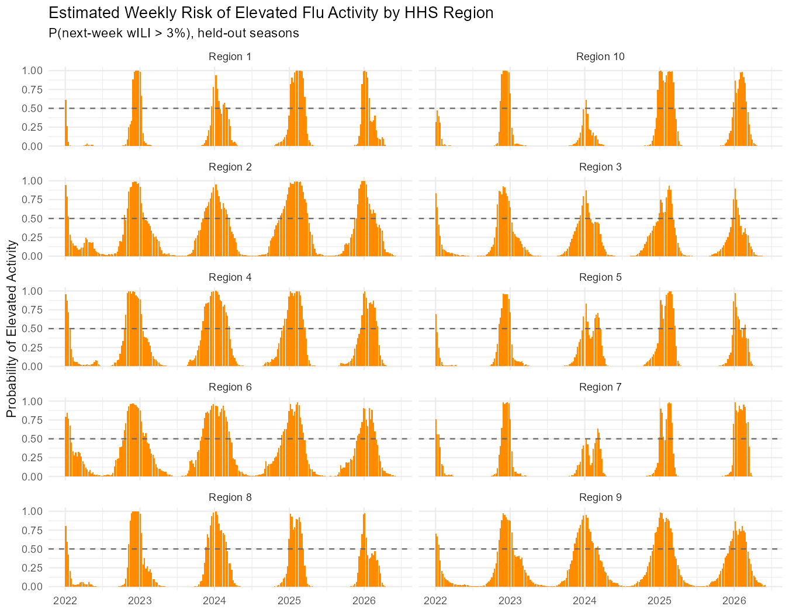

# Hierarchical Influenza Forecasting Across HHS Regions

A Bayesian hierarchical extension of a national flu forecasting model, built in R using CDC ILINet surveillance data (1997–2026) for all ten U.S. HHS regions. Each region gets its own parameters while sharing information through partial pooling, and flu "risk" is framed as the posterior probability that next week's activity crosses an elevated-activity threshold.

## Question

Does modeling influenza activity **hierarchically across regions** meaningfully improve forecasting over a single national model, and how are the regions actually different?

## Approach

- **Data:** Weekly ILINet data (CDC) for all 10 HHS regions, 1997-2026 (~15,000 observations)
- **Feature Engineering:** Cyclical seasonality, lagged weighted ILI, and lagged age-composition shares. All computed *within each region* to prevent cross-region leakage
- **Model:** Bayesian hierarchical Gamma regression (`brms`) with region-level intercepts and slopes: `(1 + wili_lag1 | region)`
- **Validation:** Training and testing data split based upon time (pre-2022 train), posterior predictive checks, and leave-one-out cross-validation comparing the hierarchical model against a non-hierarchical equivalent

## Key Findings

- The model found **genuine regional variation**: the standard deviation of region baselines is definitively non-zero, and strong negative correlation (-0.98) between a region's baseline and its momentum shows that hotter regions rely less on recent trends while cooler regions swing more with them. 
- **Partial pooling works as intended:** regions with cleaner data keep their own estimates while noisier regions borrow strength from the group, producing more reliable estimates than ten separate models would.
- **Leave-one-out cross-validation is decisive:** the hierarchical model outperforms the non-hierarchical model by ~885 units of expected log predictive density (SE approximately 50). This equates to roughly 18 standard errors, far beyond the commonly accepted threshold of 2. Regional structure is a substantial improvement, not a marginal one.

## Main output: Risk Curves per Region

Every region shows the expected seasonal pulse, but the risk curves indicate an obvious difference in shape and intensity. Hotter regions (2, 6) produce broad, sustained blocks of elevated risk, while cooler regions (1, 8) show narrower, more spiky pulses. These differences are not observable in the national-only model.

## Files

- `Flu-Project-Extension.Rmd` - full analysis (RMarkdown source)
- `Flu-Project-Extension.pdf` - knitted report with all code, output, and interpretations
- `ILINetRegional.csv` - CDC ILINet regional surveillance data
- `regional_risk_curves.png` - Primary per-region risk visualization

## Related

This project extends a [national single-region flu forecasting model](https://github.com/allenluc/influenza-forecasting)
